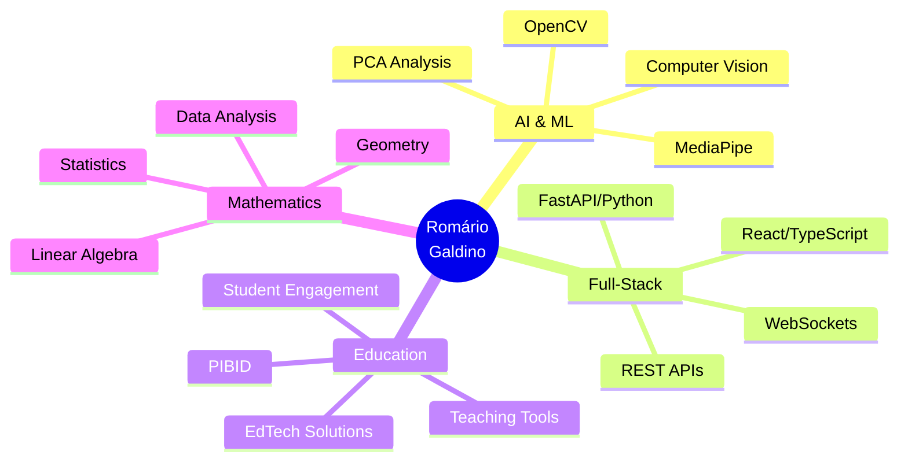

# 👋 Olá! Eu sou Romário Galdino

  
### 🎓 Professor | 💻 Full-Stack Developer | 🤖 Desenvolvedor

---

## 🚀 Sobre Mim

Sou um desenvolvedor apaixonado por **tecnologia** e **educação**, com interesse em **Inteligência Artificial** e **Visão Computacional**. Atualmente trabalho na [@jalaUniversity](https://github.com/jalasoft) criando soluções que unem tecnologia e pedagogia.

💡 **Minha missão:** Usar a tecnologia para melhorar a educação, criando ferramentas que ajudam no aprendizado e engajamento estudantil.

---

## 🌟 Projeto em Destaque

### 🎓 [VisioClass](https://github.com/RomarioSG1998) - Sistema de Monitoramento de Engajamento Estudantil

> Sistema inteligente de monitoramento em tempo real usando **Visão Computacional** e **Álgebra Linear**

**🔬 Tecnologias:**
- 🧠 **MediaPipe** - Face Mesh com 468 pontos faciais
- 📊 **PCA** - Análise de Componentes Principais
- ⚡ **WebSockets** - Comunicação em tempo real (50ms)
- 🎯 **FastAPI** - Backend de alta performance
- ⚛️ **React + TypeScript** - Interface moderna

**✨ Funcionalidades:**
- Detecção de atenção via análise biométrica (EAR - Eye Aspect Ratio)
- Identificação de fadiga através de bocejo e postura (MAR - Mouth Aspect Ratio)
- Análise de postura da cabeça (Yaw, Pitch, Roll)
- Classificação em tempo real: Atento, Distraído, Fadiga, Interação
- Dashboard para professores com métricas detalhadas
- Aplicativos desktop multiplataforma (Linux/Windows)

**📐 Matemática Aplicada:**
- Representação de rostos como matrizes R^{468×3}
- Cálculo de autovalores e autovetores
- Normas Euclidianas para distâncias faciais
- Projeções geométricas para Head Pose

---

## 🛠️ Stack Tecnológico

### Linguagens

### Frontend

### Backend

### AI/ML & Computer Vision

### Banco de Dados

### DevOps & Tools

---

## 💼 Outros Projetos

### 🌐 EnglishFlix
Plataforma completa de aprendizado de inglês com sistema de pagamentos integrado
- **Stack:** TypeScript, Node.js, Stripe API, Supabase
- **Features:** Sistema de assinaturas, chat, speaking partner, conteúdo premium

### 🏫 Sistema de Gerenciamento Escolar
Sistema completo para gestão de reforço escolar
- **Stack:** PHP, MySQL, TCPDF
- **Features:** Dashboard multi-perfil, avaliações, mensalidades, relatórios em PDF

### 📚 SintaxJavaApp
Portfólio de 9 projetos educacionais interativos
- **Projetos:** JavaHub, Estados da Água, Flashcard Matemática, Jogo da Velha, e mais
- **Stack:** HTML, CSS, JavaScript
- **Features:** Dark mode, syntax highlighting, navegação intuitiva

### 🗄️ Database Modeling Platform
Plataforma própria de modelagem de banco de dados
- **Stack:** TypeScript, Gemini API
- **Deploy:** [Vercel](https://my-own-database-modeling-platform.vercel.app)
- **Features:** Criar, editar, importar e exportar em SQL

---

## 📊 Áreas de Expertise

---

## 📈 GitHub Stats

  

---

## 🎯 O Que Estou Fazendo Agora

- 🔭 Trabalhando em **VisioClass** - Sistema de monitoramento com IA
- 🌱 Aprofundando conhecimentos em **Deep Learning** e **Neural Networks**
- 👯 Buscando colaborar em projetos de **EdTech** e **Computer Vision**
- 💬 Pergunte-me sobre **FastAPI**, **React**, **Computer Vision**, ou **Álgebra Linear**
- 📫 Como me encontrar: **rg1606694@gmail.com**

---

## 🏆 Conquistas

- ✅ Sistema de IA em produção (VisioClass)
- ✅ Aplicativos desktop multiplataforma
- ✅ Plataformas educacionais com centenas de usuários
- ✅ Integração de pagamentos (Stripe) em produção
- ✅ Contribuições para educação via PIBID

---

## 💡 Filosofia de Desenvolvimento

> "A melhor forma de prever o futuro é inventá-lo, e a melhor forma de ensinar é através da tecnologia que engaja e inspira."

- 🎯 **Foco no Impacto:** Criar soluções que realmente fazem diferença
- 🧪 **Experimentação:** Sempre testando novas tecnologias e abordagens
- 📚 **Aprendizado Contínuo:** Estudando inglês, tecnologia e história
- 🤝 **Colaboração:** Acredito no poder do código aberto e da comunidade

---

## 📫 Vamos Conversar?

Estou sempre aberto a discutir:
- 🤖 Projetos de IA e Computer Vision
- 🎓 Tecnologia na Educação
- 💻 Arquitetura de Software
- 📊 Matemática Aplicada
- 🚀 Oportunidades de Colaboração

### 💼 Aberto para oportunidades em:
**AI/ML Engineering** | **Full-Stack Development** | **EdTech Solutions** | **Research & Development**

---

⭐️ From [RomarioSG1998](https://github.com/RomarioSG1998) | 📍 Carneiros, AL - Brasil

